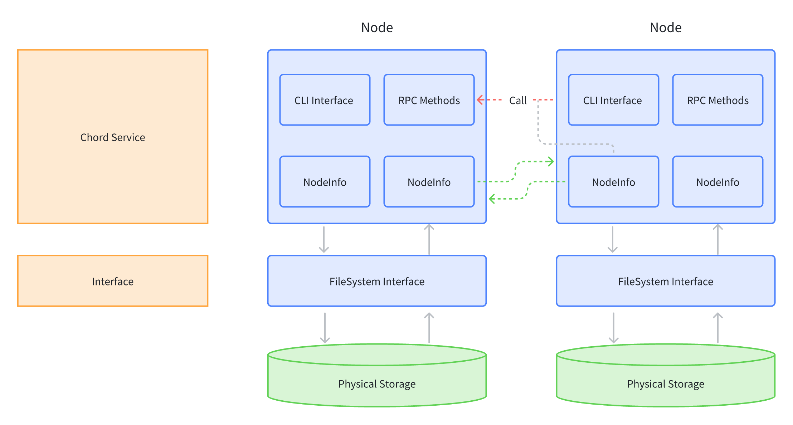

# Implement a (secure) simple distributed storage based on Chord

## 1. Introduction

In this project we implement Chord, which is described in the paper <http://www.cs.berkeley.edu/~istoica/papers/2003/chord-ton.pdf>, including the Chord protocol, algorithms, and implementation.

Chord uses local information and communicates with other peers to find the host (IP address and port) that a given key is mapped to. Applications may then be built on top of this service that Chord provides.

## 2. Chord Client

### Arguments

The Chord client will be a command-line utility which takes the following arguments:

1. `-a <String>` = The IP address that the Chord client will bind to, as well as advertise to other nodes. Represented as an ASCII string (e.g., 128.8.126.63). Must be specified.
2. `-p <Number>` = The port that the Chord client will bind to and listen on. Represented as a base-10 integer. Must be specified.
3. `--ja <String>` = The IP address of the machine running a Chord node. The Chord client will join this node's ring. Represented as an ASCII string (e.g., 128.8.126.63). Must be specified if `--jp` is specified.
4. `--jp <Number>` = The port that an existing Chord node is bound to and listening on. The Chord client will join this node's ring. Represented as a base-10 integer. Must be specified if `--ja` is specified.
5. `--ts <Number>` = The time in milliseconds between invocations of 'stabilize'. Represented as a base-10 integer. Must be specified, with a value in the range of [1,60000].
6. `--tff <Number>` = The time in milliseconds between invocations of 'fix fingers'. Represented as a base-10 integer. Must be specified, with a value in the range of [1,60000].
7. `--tcp <Number>` = The time in milliseconds between invocations of 'check predecessor'. Represented as a base-10 integer. Must be specified, with a value in the range of [1,60000].
8. `-r <Number>` = The number of successors maintained by the Chord client. Represented as a base-10 integer. Must be specified, with a value in the range of [1,32].
9. `-i <String>` = The identifier (ID) assigned to the Chord client which will override the ID computed by the SHA1 sum of the client's IP address and port number. Represented as a string of 40 characters matching [0-9a-fA-F]. Optional parameter.
10. `-aes` = Whether use AES or not. Optional parameter.
11. `-aeskey <String>` = The location of the AES key. Optional parameter. Must be specified if `-aes` is specified.
12. `-tls` = Whether use TLS or not. Optional parameter.
13. `-cacert` = The CA's certificate. Optional parameter. Must be specified if `-tls` is specified.
14. `-servercert` = The server's (when peer acts as server) certificate. Optional parameter. Must be specified if `-tls` is specified.
15. `-serverkey` = The server's (when peer acts as server) private key. Optional parameter. Must be specified if `-tls` is specified.

An example usage to start a new Chord ring is:

```shell
chord -a 128.8.126.63 -p 4170 --ts 3000 --tff 1000 --tcp 3000 -r 4
```

An example usage to join an existing Chord ring is:

```shell
chord -a 128.8.126.63 -p 4171 --ja 128.8.126.63 --jp 4170 --ts 3000 --tff 1000 --tcp 3000 -r 4
```

The Chord client will open a TCP socket and listen for incoming connections on port specified by `-p`. If neither `--ja` nor `--jp` is specified, then the Chord client starts a new ring by invoking 'create'. The Chord client will initialize the successor list and finger table appropriately (i.e., all will point to the client itself).

Otherwise, the Chord client joins an existing ring by connecting to the Chord client specified by `--ja` and `--jp` and invoking 'join'. The initial steps the Chord client takes when joining the network are described in detail in Section IV.E.1 "Node Joins and Stabilization" of the Chord paper.

Periodically, the Chord client will invoke various stabilization routines in order to handle nodes joining and leaving the network. The Chord client will invoke 'stabilize', 'fix fingers', and 'check predecessor' every `--ts`, `--tff`, and `--tcp` milliseconds, respectively.

AES provides security in the form of encrypting the files before they get uploaded. You can prepare the AES key using OpenSSL.

TLS provides security for communicating with other peers.

### Commands

The Chord client will handle commands by reading from `stdin` and writing to `stdout`.

1. 'Lookup' takes as input the name of a file to be searcher (e.g., "Hello.txt"). The Chord client takes this string, hashes it to a key in the identifier space, and performs a search for the node that is the successor to the key (i.e., the owner of the key). The Chord client then outputs that node's identifier, IP address, and port.
2. 'GetFile' takes as input the name of a file to be searcher (e.g., "Hello.txt"). First it will do the Lookup to get the target node, and then it will request the target node to get the file.
3. 'StoreFile' takes the location of a file on a local disk, then performs a "LookUp". Once the correct place of the file is found, the file gets uploaded to the Chord ring.
4. 'Storefiles' takes the location of a directory on a local disk, then do StoreFile operation one by one.
5. 'PrintState' requires no input. The Chord client outputs its local state information at the current time, which consists of:
   - The Chord client's own node information
   - The node information for all nodes in the successor list
   - The node information for all nodes in the finger table where "node information" corresponds to the identifier, IP address, and port for a given node.
6. 'Quit' requires no input. The Chord client quits from the ring.
7. 'Clear' requires no input. Clear out the screen.

## 3. Base structure



1. Node: Responsible for implementing the core functionality of the Chord protocol and including a CLI Interface. It enables distributed key lookups, node maintenance, and routing within the system. Through fileSystem interface, it can interact with the file system to perform operations such as reading and writing files.
2. NodeInfo: Contains the node’s unique identifier, IP address, and port. This information uniquely identifies a node and enables it to be called via RPC.
3. CLI Interface: Provides a command-line interface for users to interact with the node and perform operations like lookups or debugging.
4. FileSystem Interface: We define a StorageSystem which implements the FileSystem Interface, enabling caching and saving file operations on the local disk and memory.

## 4. Doc

- [TLS Principles](doc/tls.md): How to apply TLS in the project
- [TLS setup](doc/tls_setup.md): The steps of using TLS

- [Test](doc/test.md): Test on local

- [Successors and backups](doc/successors_backups.md): The replication mechanism in the project
- [Tricks and Issues](doc/tricks_issue.md): Some tricks and problems

## 5. RoadMap
