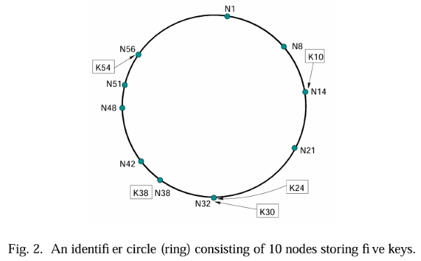
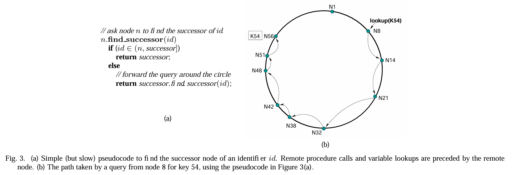
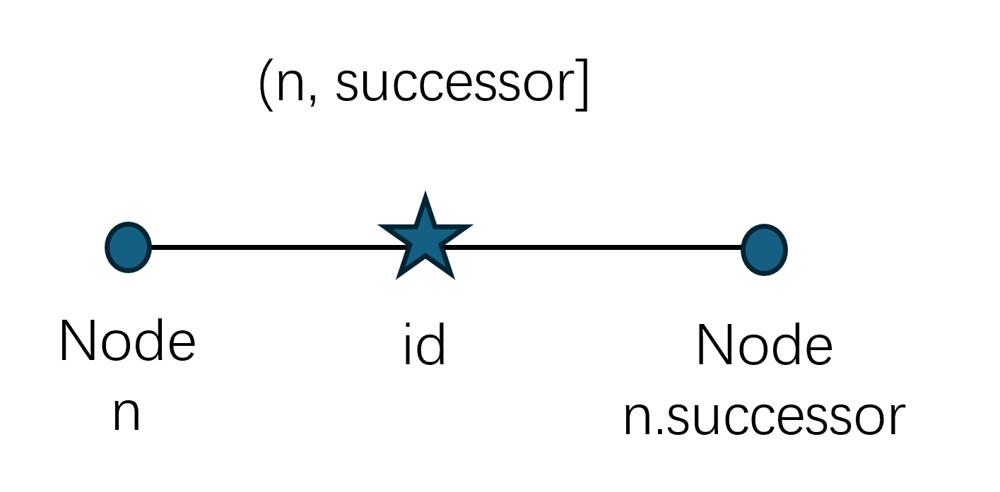
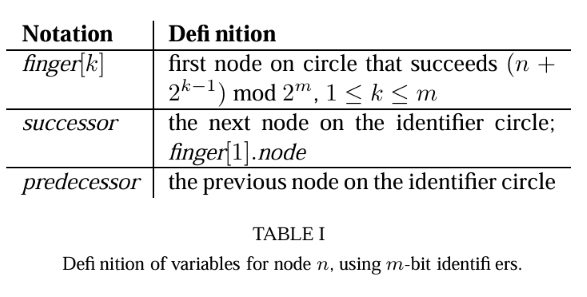
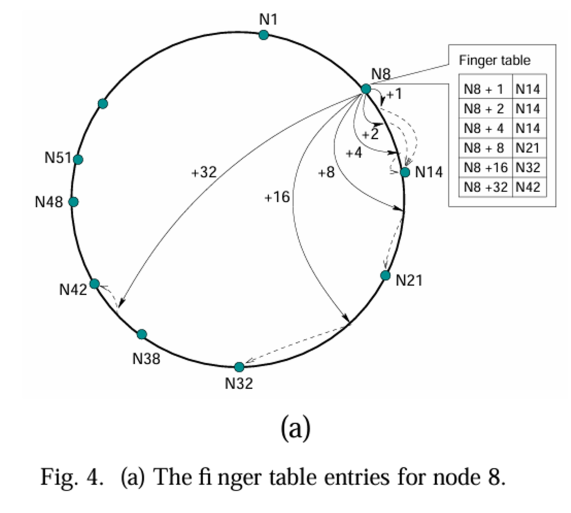
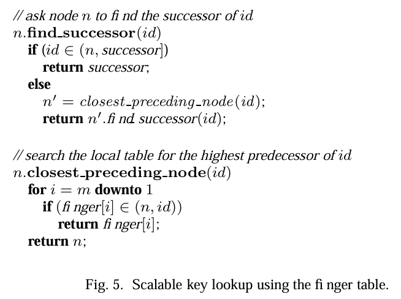
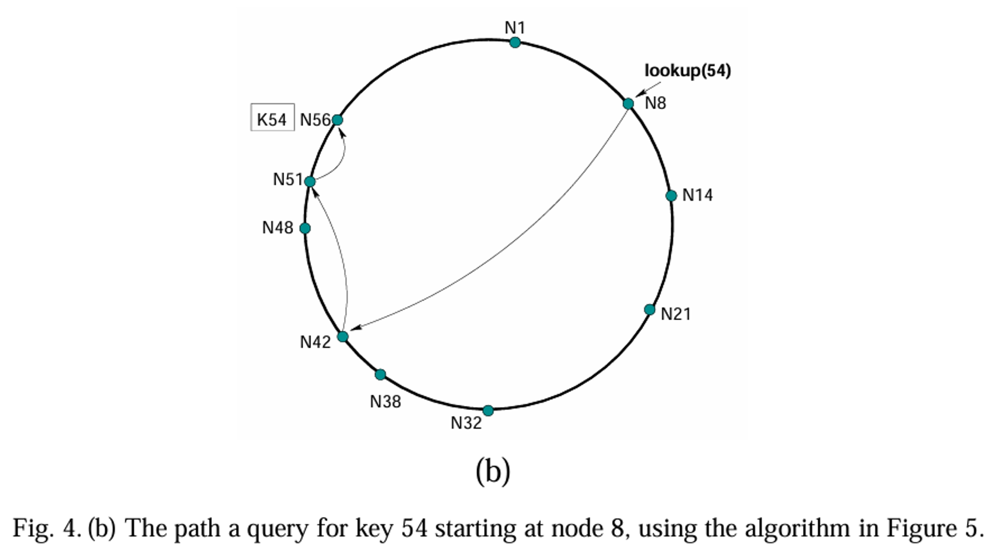
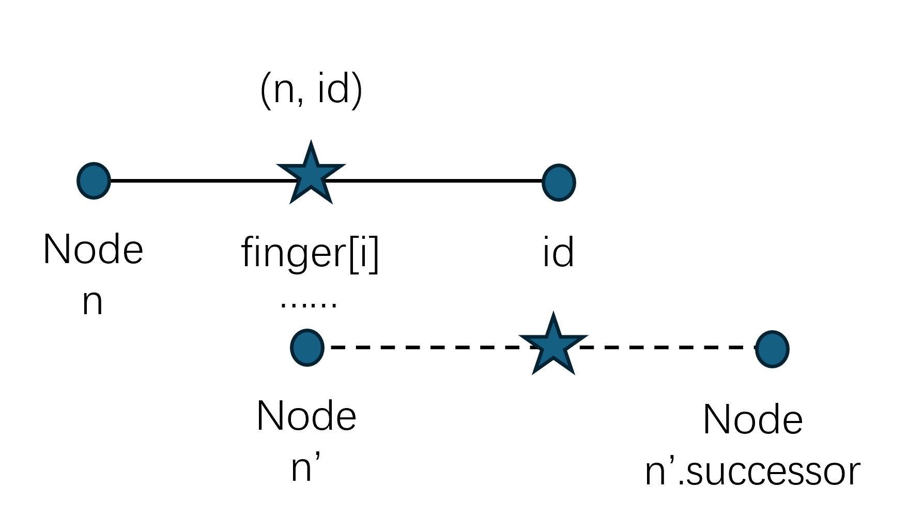
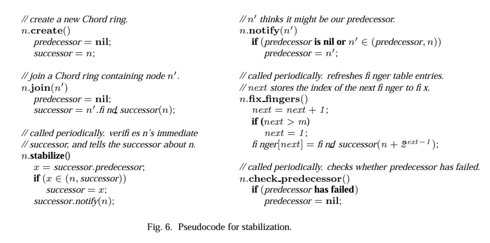
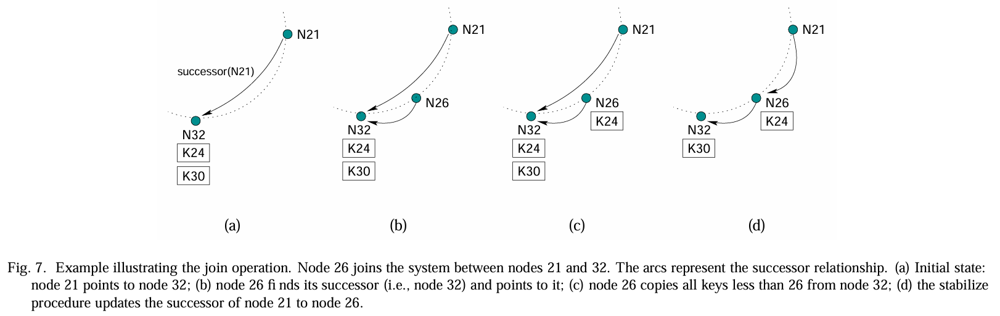

# THE CHORD PROTOCOL

This section describes the Chord protocol. The Chord protocol specifies how to find the locations of keys, how new nodes join the system, and how to recover from the failure (or planned departure) of existing nodes. In this paper we assume that communication in the underlying network is both symmetric (if $A$ can route to $B$, then $B$ can route to $A$), and transitive (if $A$ can route to $B$ and $B$ can route to $C$, then $A$ can route to $C$).

## A. Overview

## B. Consistent Hashing

The consistent hash function **assigns each node and key an $m$-bit identifier using SHA-1** as a base hash function. A node's identifier is chosen by hashing the node's IP address, while a key identifier is produced by hashing the key. We will use the term "key" to refer to both the original key and its image under the hash function, as the meaning will be clear from context. Similarly, the term "node" will refer to both the node and its identifier under the hash function. The identifier length $m$ must be large enough to make the probability of two nodes or keys hashing to the same identifier negligible.

Consistent hashing assigns keys to nodes as follows. Identifiers are ordered on an ***identifier circle*** modulo $2^m$. **Key $k$ is assigned to the first node whose identifier is equal to or follows (the identifier of) $k$ in the identifier space. This node is called the *successor node* of key $k$, denoted by $successor(k)$.** If identifiers are represented as a circle of numbers from $0$ to $2^m − 1$, then $successor(k)$ is the first node clockwise from $k$. In the remainder of this paper, we will also refer to the identifier circle as the ***Chord ring***.

Figure 2 shows a Chord ring with $m = 6$. The Chord ring has 10 nodes and stores five keys. The successor of identifier 10 is node 14, so key 10 would be located at node 14. Similarly, keys 24 and 30 would be located at node 32, key 38 at node 38, and key 54 at node 56.

Consistent hashing is designed to let nodes enter and leave the network with minimal disruption. To maintain the consistent hashing mapping when a node $n$ joins the network, certain keys previously assigned to $n$'s successor now become assigned to $n$. When node n leaves the network, all of its assigned keys are reassigned to n's successor. No other changes in assignment of keys to nodes need occur. In the example above, if a node were to join with identifier 26, it would capture the key with identifier 24 from the node with identifier 32.

The following results are proven in the papers that introduced consistent hashing:

*Theorem $IV.1$*: For any set of $N$ nodes and $K$ keys, with high probability:

1. Each node is responsible for at most $(1 + \epsilon)K/N$ keys
2. When an $(N+1)^{st}$ node joins or leaves the network, responsibility for $O(K/N)$ keys changes hands (and only to or from the joining or leaving node).

When consistent hashing is implemented as described above, the theorem proves a bound of $\epsilon = O(\log N)$. The consistent hashing paper shows that can be reduced to an arbitrarily small constant by having each node run $\Omega (\log N)$ virtual nodes, each with its own identifier. In the remainder of this paper, we will analyze all bounds in terms of work per virtual node. Thus, if each real node runs $v$ virtual nodes, all bounds should be multiplied by $v$.

---

Note:

Node and key have identifiers, which is calculated by hash (SHA-1) and then modulo $2^m$ (so $m$ is the identifier length).

Key is assigned on the node where node's id $\leq$ key's id.

## C. Simple Key Location

This section describes a simple but slow Chord lookup algorithm. Succeeding sections will describe how to extend the basic algorithm to increase efficiency, and how to maintain the correctness of Chord's routing information.

Lookups could be implemented on a Chord ring with little per-node state. Each node need only know how to contact its current successor node on the identifier circle. Queries for a given identifier could be passed around the circle via these successor pointers until they encounter a pair of nodes that straddle the desired identifier; the second in the pair is the node the query maps to.

Figure 3(a) shows pseudocode that implements simple key lookup. Remote calls and variable references are preceded by the remote node identifier, while local variable references and procedure calls omit the local node. Thus $n.foo()$ denotes are mote procedure call of procedure $foo$ on node $n$, while $n.bar$, without parentheses, is an RPC to fetch a variable $bar$ from node $n$. The notation $(a,b]$ denotes the segment of the Chord ring obtained by moving clockwise from (but not including) $a$ until reaching (and including) $b$.

Figure 3(b) shows an example in which node 8 performs a lookup for key 54. Node 8 invokes $find_successor$ for key 54 which eventually returns the successor of that key, node 56. The query visits every node on the circle between nodes 8 and 56. The result returns along the reverse of the path followed by the query.

---

Note:

## D. Scalable Key Location

The lookup scheme presented in the previous section uses a number of messages linear in the number of nodes. To accelerate lookups, Chord maintains additional routing information. This additional information is not essential for correctness, which is achieved as long as each node knows its correct successor.

As before, let $m$ be the number of bits in the key/node identifiers. **Each node $n$ maintains a routing table with up to $m$ entries (we will see that in fact only $O(\log n)$ are distinct), called the finger table.** The $i^{th}$ entry in the table at node $n$ contains the identity of the first node $s$ that succeeds $n$ by at least $2^{i−1}$ on the identifier circle, i.e., $s = successor(n + 2^{i−1})$, where $1 ≤ i ≤ m$ (and all arithmetic is modulo $2^m$). We call node $s$ the $i^{th}$ finger of node $n$, and denote it by $n.finger[i]$ (see Table $I$). A finger table entry includes both the Chord identifier and the IP address (and port number) of the relevant node. Note that the first finger of $n$ is the immediate successor of $n$ on the circle; for convenience we often refer to the **first** finger as the $successor$.

The example in Figure 4(a) shows the finger table of node 8. The first finger of node 8 points to node 14, as node 14 is the first node that succeeds $(8 + 2^0) \mod 2^6 = 9$. Similarly, the last finger of node 8 points to node 42, as node 42 is the first node that succeeds $(8 + 2^5) \mod 2^6 = 40$.

This scheme has two important characteristics. First, each node stores information about only a small number of other nodes, and **knows more about nodes closely following it on the identifier circle than about nodes farther away**. Second, a node's finger table generally does not contain enough information to directly determine the successor of an arbitrary key $k$. For example, node 8 in Figure 4(a) cannot determine the successor of key 34 by itself, as this successor (node 38) does not appear in node 8's finger table.

Figure 5 shows the pseudocode of the $find \_ successor$ operation, extended to use finger tables. If $id$ falls between $n$ and its successor, $find \_ successor$ is finished and node $n$ returns its successor. Otherwise, $n$ searches its finger table for the node $n$ whose ID most immediately precedes $id$, and then invokes $find \_ successor$ at $n'$. The reason behind this choice of $n'$ is that the closer $n'$ is to $id$, the more it will know about the identifier circle in the region of $id$.

As an example, consider the Chord circle in Figure 4(b), and suppose node 8 wants to find the successor of key 54. Since the largest finger of node 8 that precedes 54 is node 42, node 8 will ask node 42 to resolve the query. In turn, node 42 will determine the largest finger in its finger table that precedes 54, i.e., node 51. Finally, node 51 will discover that its own successor, node 56, succeeds key 54, and thus will return node 56 to node 8.

Since each node has finger entries at power of two intervals around the identifier circle, each node can forward a query at least halfway along the remaining distance between the node and the target identifier. From this intuition follows a theorem:

*Theorem $IV.2$*: With high probability, the number of nodes that must be contacted to find a successor in an $N$-node network is $O(\log N)$.

---

Note:

In figure 5, we can see that, first we check $(n, successor]$, if failed, then check the finger table.

The searching order in $closest\_preceding\_node(id)$ starts from the last entry of finger table.

## E. Dynamic Operations and Failures

In practice, Chord needs to deal with nodes joining the system and with nodes that fail or leave voluntarily. This section describes how Chord handles these situations.

### E.1 Node Joins and Stabilization

In order to ensure that lookups execute correctly as the set of participating nodes changes, Chord must ensure that each node's successor pointer is up to date. It does this using a "stabilization" protocol that each node runs periodically in the background and which updates Chord's finger tables and successor pointers.

Figure 6 shows the pseudocode for joins and stabilization. When node $n$ first starts, it calls $n.join(n')$, where $n'$ is any  known Chord node, or $n.create()$ to create a new Chord network. The $join()$ function asks $n'$ to find the immediate successor of $n$. By itself, $join()$ does not make the rest of the network aware of $n$.

Every node runs $stabilize()$ periodically to learn about newly joined nodes. Each time node $n$ runs $stabilize()$, it asks its successor for the successor's predecessor $p$, and decides whether $p$ should be $n$'s successor instead. This would be the case if node $p$ recently joined the system. In addition, $stabilize()$ notifies node $n$'s successor of $n$'s existence, giving the successor the chance to change its predecessor to $n$. The successor does this only if it knows of no closer predecessor than $n$.

Each node periodically calls $fix \_ fingers$ to make sure its finger table entries are correct; this is how new nodes initialize their finger tables, and it is how existing nodes incorporate new nodes into their finger tables. Each node also runs $check \_ predecessor$ periodically, to clear the node's predecessor pointer if $n.predecessor$ has failed; this allows it to accept a new predecessor in $notify$.

As a simple example, suppose node $n$ joins the system, and its ID lies between nodes $n_p$ and $n_s$.

- In its call to $join()$, $n$ acquires $n_s$ as its successor.
- Node $n_s$, when notified by $n$, acquires $n$ as its predecessor.
- When $n_p$ next runs $stabilize()$, it asks $n_s$ for its predecessor (which is now $n$); $n_p$ then acquires $n$ as its successor.
- Finally, $n_p$ notifies $n$, and $n$ acquires $n_p$ as its predecessor.

At this point, all predecessor and successor pointers are correct. At each step in the process, $n_s$ is reachable from $n_p$ using successor pointers; this means that lookups concurrent with the join are not disrupted.

Figure 7 illustrates the join procedure, when $n$'s ID is 26, and the IDs of $n_s$ and $n_p$ are 21 and 32, respectively.

As soon as the successor pointers are correct, calls to $find \_ successor()$ will reflect the new node. Newly-joined nodes that are not yet reflected in other nodes' finger tables may cause $find \_ successor()$ to initially undershoot,but the loop in the lookup algorithm will nevertheless follow successor ($finger[1]$) pointers through the newly-joined nodes until the correct predecessor is reached. Eventually $fix \_ fingers()$ will adjust finger table entries, eliminating the need for these linear scans.

The following result shows that the inconsistent state caused by concurrent joins is transient.

*Theorem $IV.3$*: If any sequence of join operations is executed interleaved with stabilizations, then at some time after the last join the successor pointers will form a cycle on all the nodes in the network.

### E.2 Impact of Node Joins on Lookups

### E.3 Failure and Replication

The correctness of the Chord protocol relies on the fact that each node knows its successor. However, this invariant can be compromised if nodes fail. For example, in Figure 4, if nodes 14, 21, and 32 fail simultaneously, node 8 will not know that node 38 is now its successor, since it has no finger pointing to 38. An incorrect successor will lead to incorrect lookups. Consider a query for key 30 initiated by node 8. Node 8 will return node 42, the first node it knows about from its finger table, instead of the correct successor, node 38.

**To increase robustness, each Chord node maintains a successor list of size $r$, containing the node's first $r$ successors.** If a node's immediate successor does not respond, the node can substitute the second entry in its successor list. All $r$ successors would have to simultaneously fail in order to disrupt the Chord ring, an event that can be made very improbable with modest values of $r$. Assuming each node fails independently with prob ability $p$, the probability that all $r$ successors fail simultaneously is only $p^r$. Increasing $r$ makes the system more robust.

Handling the successor list requires minor changes in the pseudocode in Figures 5 and 6. A modified version of the $stabilize$ procedure in Figure 6 maintains the successor list. Successor lists are stabilized as follows:

- node $n$ reconciles its list with its successor $s$ by copying $s$'s successor list, removing its last entry, and prepending $s$ to it.
- If node $n$ notices that its successor has failed, it replaces it with the first live entry in its successor list and reconciles its successor list with its new successor.

At that point, $n$ can direct ordinary lookups for keys for which the failed node was the successor to the new successor. As time passes, $fix \_ fingers$ and $stabilize$ will correct finger table entries and successor list entries pointing to the failed node.

A modified version of the $closest \_ preceding \_ node$ procedure in Figure 5 searches not only the finger table but also the successor list for the most immediate predecessor of $id$. In addition, the pseudocode needs to be enhanced to handle node failures. If a node fails during the $find \_ successor$ procedure, the lookup proceeds, after a timeout, by trying the next best predecessor among the nodes in the finger table and the successor list.

### E.4 Voluntary Node Departures

Since Chord is robust in the face of failures, a node voluntarily leaving the system could be treated as a node failure. However, two enhancements can improve Chord performance when nodes leave voluntarily. First, a node $n$ that is about to leave may transfer its keys to its successor before it departs. Second, $n$ may notify its predecessor $p$ and successor s before leaving. In turn, node $p$ will remove $n$ from its successor list, and add the last node in $n$'s successor list to its own list. Similarly, node $s$ will replace its predecessor with $n$'s predecessor. Here we assume that $n$ sends its predecessor to $s$, and the last node in its successor list to $p$.
