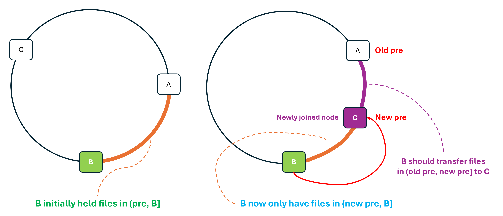

# Notify and Transfer

At the end of `Notify()`, we may need to transfer the files to the old predecessor.

```go
func (node *Node) Notify(nodeInfo *NodeInfo) {
    oldPredecessor := node.GetPredecessor()
    // if oldPredecessor is nil or n' in (oldPredecessor, n)
    if oldPredecessor.Empty() || tools.ModIntervalCheck(nodeInfo.Identifier, oldPredecessor.Identifier, node.info.Identifier, false, false) {
        // before setting we need to check the nodeInfo
        if err := nodeInfo.LiveCheck(); err != nil {
            return
        }
        node.SetPredecessor(nodeInfo)
        // now the predecessor is set, the node should check its files, try to find the files that should be transferred to the new predecessor
        node.transferFilesToPredecessor(oldPredecessor)
    }
    // in this case, the predecessor is not changed, so we don't need to transfer files
}
```

We have to check the `oldPredecessor` before transferring files.

1. If `oldPredecessor` is itself, then do nothing.
2. If `oldPredecessor` is nil or dead, then do nothing.
3. If `oldPredecessor` is neither nil nor dead, then transfer the files whose IDs belong to (oldPredecessor, predecessor] to the `oldPredecessor`.

Situation 3, normal case, node C join in the ring and insert between A and B:



Situation 2, node A is dead:


