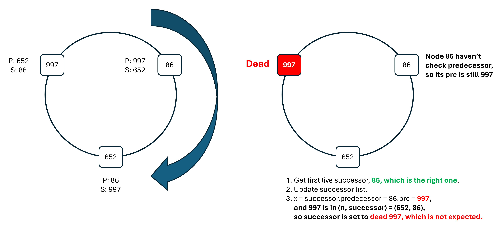
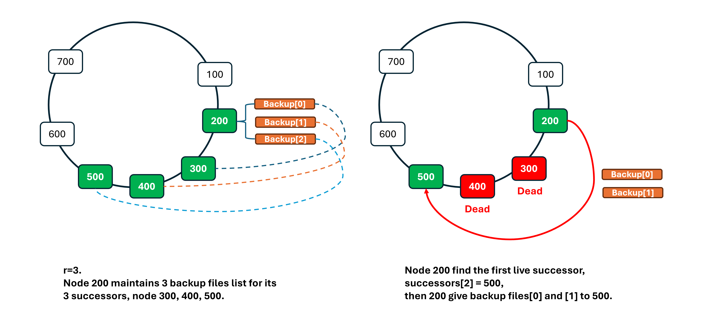

# Successor List and Back Up Files

## In Paper

> E.3 Failure and Replication
>
> **To increase robustness, each Chord node maintains a successor list of size $r$, containing the node's first $r$ successors.**
>
> If a node's immediate successor does not respond, the node can substitute the second entry in its successor list. All $r$ successors would have to simultaneously fail in order to disrupt the Chord ring, an event that can be made very improbable with modest values of $r$. Assuming each node fails independently with prob ability $p$, the probability that all $r$ successors fail simultaneously is only $p^r$. Increasing $r$ makes the system more robust.
>
> Handling the successor list requires minor changes in the pseudocode in Figures 5 and 6. A modified version of the $stabilize$ procedure in Figure 6 maintains the successor list. Successor lists are stabilized as follows:
>
> - node $n$ reconciles its list with its successor $s$ by copying $s$'s successor list, removing its last entry, and prepending $s$ to it.
> - If node $n$ notices that its successor has failed, it replaces it with the first live entry in its successor list and reconciles its successor list with its new successor.
>
> At that point, $n$ can direct ordinary lookups for keys for which the failed node was the successor to the new successor. As time passes, $fix \_ fingers$ and $stabilize$ will correct finger table entries and successor list entries pointing to the failed node.
>
> A modified version of the $closest \_ preceding \_ node$ procedure in Figure 5 searches not only the finger table but also the successor list for the most immediate predecessor of $id$. In addition, the pseudocode needs to be enhanced to handle node failures. If a node fails during the $find \_ successor$ procedure, the lookup proceeds, after a timeout, by trying the next best predecessor among the nodes in the finger table and the successor list.

## How to implement successor list

stabilize:

```go
func (node *Node) stabilize() {
    findAndSetFirstLiveSuccessor()
    handleX() // check x = successor.predecessor, and should check live
    updateSuccessors()
    successor.Notify(&node.Info)
}
```

It is better to check `successor.predecessor` before updating successor list, as we don't want `handleX()` to change the `successors[0]` after updating the successor list, which might make the rest successors can't stay with `successors[0]`.

If we do `updateSuccessors()` before `handleX()`, there might be problems, for example:



closestPrecedingNode:

```go
func (node *Node) closestPrecedingNode(identifier *big.Int) *NodeInfo {
    fingerEntry := node.findNearestNode(identifier, node.FingerTable)
    successors, err := fingerEntry.GetSuccessors()
    successorEntry := fingerEntry.findNearestNode(identifier, successors)
    return successorEntry
}

func (nodeInfo *NodeInfo) findNearestNode(identifier *big.Int, nodeList NodeInfoList) *NodeInfo {
    for i := len(nodeList) - 1; i >= 0; i-- {
        if nodeList[i] is in (n, id) {
            return nodeList[i]
        }
    }
    return nodeInfo
}
```

## How to implement backup files list corresponding successor list

We can imitate the mechanism of successor list, each Chord node maintains a backup files list of size $r$, containing the node's first $r$ successor's files.

And we should gather the part of update successor list and the part of update backup files list.

```go
func (node *Node) updateReplica() {
    index := findandSetFirstLiveSuccessor() // return the first live successor index
    if index != 0 {
        oldBackupFileList = node.BackupFiles[0:index] // in go, slice is [start, end)
    }
    handleX() // check x = successor.predecessor, and should check live
    successors[0].StoreFiles(oldBackupFileList) // give the files to successor[0]
    updateSuccessors()
    successor.Notify(&node.Info)
}
```



## Change in Quit

> E.4 Voluntary Node Departures
>
> Since Chord is robust in the face of failures, a node voluntarily leaving the system could be treated as a node failure. However, two enhancements can improve Chord performance when nodes leave voluntarily. First, a node $n$ that is about to leave may transfer its keys to its successor before it departs. Second, $n$ may notify its predecessor $p$ and successor s before leaving. In turn, node $p$ will remove $n$ from its successor list, and add the last node in $n$'s successor list to its own list. Similarly, node $s$ will replace its predecessor with $n$'s predecessor. Here we assume that $n$ sends its predecessor to $s$, and the last node in its successor list to $p$.

We should notice that, as a failed node's predecessor transfers the failed node's files to the failed node's successor, what we do in the replication part has already done it. So when implementing the quit function, we just need to do the above second part.

## How to handle the failure in the redundant system

We introduce this redundant system to make the chord ring working well even when a series of $r-1$ nodes fail. But what will happen if the redundant system itslef fails? We need to check them one by one:

1. error in `node.GetBackupFilesUpToIndex(indexOfFirstLiveSuccessor)`: it means the storage system fails, we could do nothing but just log it.
2. error in `handleX()`, specifically in `successor.GetPredecessor()`: it means we can't get predecessor from the successor. But it just means we don't need to update the successor here, just need to log it.
3. error in `node.sendBackupFiles(oldBackupFileList)`, specifically error and `reply.Success=false` in `successor.StoreFiles(oldBackupFileList)`: it means the store process fails. If this send call fails, then we need to **store these old backup files to the node's storage**, so that the new successor can get them later through notifying (the node), and the node will send them again!
4. error in `node.updateSuccessors()`:
   - This function will only fail if we can't get the successor's successors (or wrong length).
   - If it happens, then the node's successor list will just remain the same (not updated).
   - Finally, we choose to return the error here, without doing `updateBackupFiles()`.
5. error in `node.updateBackupFiles()`: When updating the backup files, there is one thing to note: the backup files on the local disk should be consistent with the successor list finally.
   - If we can't get the files files from successor[0], then we can't do the following steps, and we need to clear all the backup files on the local disk.
   - If we can't get the backup files from successor[0] (also in-appropriate backup files list length), then we need to log it, and record the error, **but we can still do the following steps**, because we have already got the successor[0]'s files, and we can place them into backupStorages[0].
