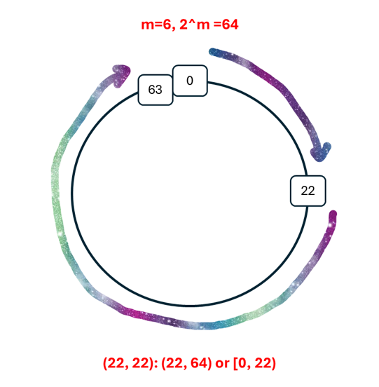

# Tricks and Issues

## Iterative Lookups

In <https://cs.utahtech.edu/cs/3410/asst_chord.html>, we can find pseudocode for the iterative find function. However, the code has some differences from the paper's functions, regarding whether the interval is open or not.

## Mod Interval

> Consistent hashing assigns keys to nodes as follows. Identifiers are ordered on an ***identifier circle*** modulo $2^m$. **Key $k$ is assigned to the first node whose identifier is equal to or follows (the identifier of) $k$ in the identifier space. This node is called the *successor node* of key $k$, denoted by $successor(k)$.** If identifiers are represented as a circle of numbers from $0$ to $2^m − 1$, then $successor(k)$ is the first node clockwise from $k$.

At first, we simply realized: key's ID $\leq$ its successor node's ID. But what if $m=6$, and there are only several nodes whose IDs are 6, 10, 13, 40, and a key whose ID is 58 needs to find a successor? Key 58 should let node 6 become its successor, as the clockwise goes.

So as in the functions in the paper. Let's see the interval: (22, 22), it doesn't contain any numbers in a normal case. But in mod, we can imagine a clockwise direction, that means from 22 to the max number, and from 0 to 22.



## RPC

### `callRPC` Function

The `callRPC` function will return both the RPC (handler) function error and the RPC call error, like network problems, so we need to distinguish these errors apart on the caller side.

Alternatively, we can make the handler function always return `nil`, so that if the `callRPC` function returns an error, we could know that it's an RPC call error. If the RPC (handler) function needs to return any error, we put it into `reply.Success`, as shown below:

```go
// StoreFileRPC : Store the file in the node's storage
func (handler *RPCHandler) StoreFileRPC(args *StoreFileArgs, reply *StoreFileReply) error {
    defer log.LogFunction()()

    file := args.File

    err := localNode.StoreFile(file.Key, file.Value)
    if err != nil {
        reply.Success = false
    } else {
        reply.Success = true
    }
    return nil
}
```

### Separate Handler

At first, we used `node *Node` as the RPC (handler) function's receiver, as most of the RPC functions need to use the node. But later we thought it was unwise to register the node in RPC, as we didn't want any remote entities to invoke the exported methods of the node. So we set `RPCHandler` as an alternative.

```go
type RPCHandler int

func (node *Node) startServer() {
    handler := new(RPCHandler)
    if err := rpc.Register(handler); err != nil {
        fmt.Println("Failed to register RPC server:", err)
        os.Exit(1)
    }

    listener, err := net.Listen("tcp", ":"+node.info.Port)
    if err != nil {
        os.Exit(1)
    }

    go func() {
        for {
            if conn, err := listener.Accept(); err != nil {
                continue
            } else {
                go rpc.ServeConn(conn)
            }
        }
    }()
}
```

### Some Non-reply RPC Function

In a normal RPC process, the caller will wait for the RPC (handler) function until it returns. But in some situations, the RPC function doesn't need to reply with anything, and maybe it will process for a long time. In this case, obviously the RPC function can return `nil` earlier, and start a goroutine to do its work, just as below:

```go
// NotifySuccessorLeaveRPC : Notify the node that its successor is leaving
func (handler *RPCHandler) NotifySuccessorLeaveRPC(args *Empty, reply *Empty) error {
    defer log.LogFunction()()
    // Empty reply, don't need the caller to wait for the reply,
    // so we can use the asyncHandleRPC function to handle the RPC logic
    asyncHandleRPC(func() {
        localNode.NotifySuccessorLeave()
    })
    return nil
}

// asyncHandleRPC abstracts the common logic for handling RPC calls with empty replies asynchronously.
// We could simply use a goroutine in the RPC func, but we emphasize the asynchronous procedure here.
func asyncHandleRPC(handler func()) {
    go func() {
        handler()
    }()
}
```

## Storage File System

### Interface

At first, we directly handled the files in the code, which made the code complex and not concise enough. Then we realized that we could decouple the logic outside the node logic, so we created an interface:

```go
type Storage interface {
    CheckFiles()
    GetFilesName() []string
    Get(fileKey string) ([]byte, error)
    Put(fileKey string, value []byte) error
    Update(fileKey string, newValue []byte) error
    Delete(fileKey string) error
    GetFilesByFilter(filter func(string) bool) (FileList, error)
    PutFiles(files FileList) error
    GetAllFiles() (FileList, error)
    Clear() error
    ExtractFilesByFilter(filter func(string) bool) (FileList, error)
}
```

And use it in the node, so that we can use these methods! If we want to change the way we handle the files, like using a database, we could simply write another implementation of this interface and don't need to change the node part.

### Cache File System

We developed a cache file system. We thought that if we needed to load the files from disk every time, the process would be too slow. A natural thought is that we can introduce a cache. According to the principle of locality, the files we visited before are more likely to be revisited, so the cache will boost the operations relevant to files.

## Lock

Why do we need to use locks? Because there are several competitions:

- Between periodic tasks `stabilize()` and `fixFingers()` (yes, not relevant with `checkPredecessor()`).
  - `stabilize()`: successors and backup files (maybe its files)
  - `fixFingers()`: fingertable and successors[0] (as it will use find to search, and find will use successor[0])
- Three periodic tasks and cmd input commands
- The above two and the RPC function (will be called anytime)

At first, we tried to add a lock for the entire node struct and use the lock to protect three periodic tasks and every RPC function, but we soon found:

- The node's task holds a lock and calls the RPC function of itself, while the RPC function also requires the lock, causing the program to get stuck -- a deadlock.
  - A possible solution is to distinguish the address before calling. If the address is its own address, then the node will not use an RPC call and will try to use the function locally.
  - Another solution might be the reentrant lock. However, Golang doesn't provide this implementation.
- There was a strict performance limit, and many RPC calls (connections) were refused by the peer.

Then we tried to use more locks for different members of the node struct, like `muPre sync.RWMutex`, `muSuc sync.RWMutex`, `muFin sync.RWMutex`, but it still didn't work well (though it's a good implementation). We realized that the locks were used with too-coarse granularity; we shouldn't protect the whole `stabilize()` task or `fixFingers()` task.

Now, the solution we choose is to use the finest granularity -- provide getter/setter for these members and add locks for them.

Finally, though the solution works well now, we still have some questions:

- A too-fine granularity will increase the frequency of lock requests and lock releases, which will add additional instructions. We must find a balance between too-fine and too-coarse granularity. The optimum granularity will have to be found by trial and error, and it is a big challenge.
- Though we find that providing full protection for periodic tasks and every RPC function is not a feasible solution, while using the finest lock in getter/setter functions is, it doesn't mean it is right -- these tasks and functions theoretically should be protected by locks. Otherwise, when processing, they may find one variable has a different value!
